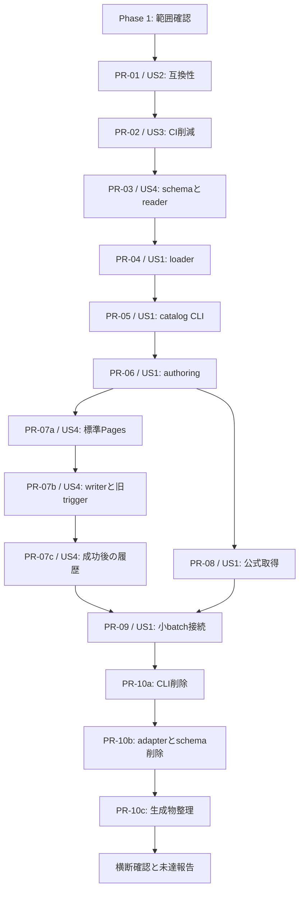

# Tasks: 既存教材の保守・公開を段階的に簡略化する

**Input**:
[spec.md](spec.md)、[plan.md](plan.md)、[research.md](research.md)、[data-model.md](data-model.md)、[contracts/compatibility.md](contracts/compatibility.md)、[quickstart.md](quickstart.md)。

**Prerequisites**:
[憲章4.0.0](../../.specify/memory/constitution.md)と[更新マニュアル](../../docs/operations/update-manual.md)を読む。既存のAstro・TypeScript・Vitest・Playwright・schema生成器を改修する。プロジェクト再初期化、新framework、新規backend、承認・状態管理・証跡台帳を追加するタスクはない。Node/npmと依存は既存`.nvmrc`、`package.json`、lockfileを維持し、必要な場合だけ`npm ci`する。

**追加条件の適用**:

- この実装では既存教材の内容変更・再生成・再分類を原則禁止する。`src/content/docs/`、既存Problem/Tag/Outcome/Unit、source、配置、前提、metrics、読書順の内容を保持する。訂正・追加・取消の試験は一時コピーと使い捨てfixtureで行い、教材の差分をcommitしない。
- 例外は運用互換性に必要な生成schemaと、実配信成功後の既存`src/content/indexes/release-history.json`への追記のみ。本文やtaxonomyを変える口実に使わない。schema生成は教材再生成とは区別する。
- 実教材の訂正・1
  Contest追加・その公開はこのタスク一覧の実装対象に含めない。SC-004とM5の実運用受入は、別の教材変更依頼で確認するまで未達と報告する。仕様を弱めたり、fixture成功を実公開成功と数えたりしない。
- 削除・簡略化を先行する。ただし参照中のproducer/台帳はconsumer移行後に削除する。旧CLIを成功するno-opに置き換えず、検証失敗を隠さない。
- 人間・第三者・別エージェントの承認を完了条件にしない。GitHub実設定・接続不足は具体的な未完了として扱う。タスク生成時点では実装・外部設定・merge・deployは未実施。現在の実装状況は各タスクのチェックと対応PRを参照する。

**Organization**: 各実装フェーズは1つのstoryと1つのPRを担当する。story全体に複数のPRが必要なため、同じstoryを複数フェーズに分ける。P1のUS2互換性とUS3検証簡略化を先行し、US4のreader準備をUS1の前提として配置する。順序はplanの依存に従い、ユーザーstoryを横断する巨大PRを作らない。PR-07は標準配信導入・writer/旧trigger切替・成功済み版の履歴追記の3PR、PR-10はCLI・adapter/schema・生成物の削除へ分割する。

**Format**:
`- [ ] TNNN [P?] [USn?] 説明と対象path`。IDはこの一覧の順に付ける。`[P]`は同じPR内で前提が完了した後、異なるファイルを並列に作業できる項目だけを示す。複数エージェントの使用は要求しない。

## 共通の検証・PR完了条件

すべてのPRで、対象差分と実施検証をPR本文または完了報告へ一度まとめ、手順を変える場合は同じPRで`docs/operations/update-manual.md`を更新する。別spec・manifest・review
evidence・digest台帳を作らない。未実行・失敗・外部設定未完了を明記する。

構造化データ/schema変更ではschema生成物との一致に加え実データの意味検証を行う。挙動変更の回帰は既存テストを拡張し、変更前に問題を検出できるケースを用意する。数学的正しさはschema通過だけで判定しない。planのValidation
Selectionとquickstartの対象subsetを使う。

公開出力へ影響するPRでは次を1回実行し、同じ出力をリンク・必要なE2Eで再利用する。PR-02で`check`とbuildの重複`astro check`を整理した後の意味をマニュアルに記す。

```sh
SITE_URL=https://fu-l.github.io BASE_PATH=/abc-textbook npm run build
SITE_URL=https://fu-l.github.io BASE_PATH=/abc-textbook npm run link:check:built
SITE_URL=https://fu-l.github.io BASE_PATH=/abc-textbook npm run test:e2e:built -- --project=chromium tests/e2e/full-projection.spec.ts tests/e2e/search.spec.ts tests/e2e/learning-records.spec.ts
```

E2Eは実際の変更に関係するspecだけを選ぶ。他ブラウザー・数学・性能の検査は影響がある場合に限定する。運用文書のみでは対象の書式・ローカルリンク・整合性を確認する。全PRで教材差分0と既存の未commit変更の保持を確認する。

PR-07a以降のローカルbuildは[build入力契約](contracts/compatibility.md#ローカルbuildとactionsの入力)に従い、上記コマンドのまま基準版の未公開candidateを作り、metadataを生成しない。実配信用の新版とmetadataはActionsの実run入力から作る。fixture入力での成功を実配信の成功として扱わない。

## Phase 1: 既存作業の範囲確認（実装前、再初期化なし）

**Goal**: 現在の変更を保ち、実装対象と禁止対象を特定する。ここだけの準備PRは作らず、PR-01の作業開始時に行う。

<!-- prettier-ignore -->
- [X] T001 `AGENTS.md`、`.specify/memory/constitution.md`、`docs/operations/update-manual.md`、`specs/002-simplify-maintenance/plan.md`を読み、Git差分から既存の未commit変更と教材変更禁止範囲を確認する。ブランチ・feature選択・依存の再初期化を行わない。
- [X] T002 `specs/002-simplify-maintenance/tasks.md`の依存順・要求対応を現行`package.json`、`.github/workflows/ci.yml`、`src/lib/catalog/full-public-projection.ts`と照合し、実装中に判明した差だけ本一覧へ反映する。旧仕様の承認義務と技術的consumerを区別する。

**完了条件**: 対象path、教材禁止範囲、現在のconsumerと保持する差分が確認でき、未実装の簡素化を実装済みと扱っていない。

**Foundational
phase**: 独立した共通基盤の新設は不要。以下のPR-01互換性検査とPR-02の旧必須経路整理を、後続変更の共通前提とする。

## Phase 2 / PR-01: US2 — 教材・URL・学習記録の互換性比較（P1 / M1）

**Goal**: 移行の前後で失ってはいけないものを、既存Gitと一時buildから比較する。

**Independent Test**: 868問・213タグ・242 Outcome・232
UnitのID/本文bytes/配置/3DAG/読書順と、全公開URL/anchorを比較する。100件以上の旧backup・未知ID・旧DB・独立日時・原子的復元は既存fixtureで確認する。

<!-- prettier-ignore -->
- [X] T003 [P] [US2] `tests/integration/full-public-projection.test.ts`と`tests/unit/textbook-order.test.ts`へ不足する前後比較を追加する。既存commitと一時コピーからID集合、本文bytes、配置、Tag/Outcome/Unit各直接前提と教科書順を比較し、本文欠落や再分類を検出する。新しい凍結manifestや全本文digestをcommitしない。
- [X] T004 [P] [US2] `tests/integration/internal-links.test.ts`と`tests/e2e/full-projection.spec.ts`へ、一時領域の旧/new buildの全HTML・data URLとanchor集合の比較を追加する。リンク元とリンク先が同時に消えるケース、既存公開JSON/feed/sitemap/updatesの欠落を検出する。
- [X] T005 [P] [US2] `tests/integration/learning-record-backup.test.ts`、`tests/unit/learning-record-timestamp.test.ts`、`tests/e2e/learning-records.spec.ts`の既存ケースを確認し、不足する旧DB version 1・100件以上・未知/取消ID・独立日時・reload・複数タブ・保存失敗・原子的復元だけを補う。`src/lib/learning-records/database.ts`とbackup形式は変更しない。
- [X] T006 [US2] T003〜T005とquickstartのPR-01 subsetを実行し、`docs/operations/update-manual.md`へ比較方法を記す。`.github/workflows/ci.yml`と`initial-release-audit.yml`の各検査が検出する不具合・残す検出手段・時間、比較元SHA/公開SHA、CI時間の計測境界を既存ActionsログからPR本文へまとめる。観測できない値を補作しない。

**完了条件**:
SC-001〜003を後続PRで再実行できる比較方法があり、旧記録の検査が成功する。移行前CIの同種・同規模の実測基準を確認するか、取得不足を明記する。

**PR-01で確認した現行実装との差**:

- 作業開始時は`main`で差分0、002設計はcommit済みだった。既存状態を再初期化せず、Issue
  #75のPR用ブランチでT001〜T006だけを実装した。後続タスクは未実施。
- Problem metadataには`docPath`がなく、本文frontmatterの`authoringUnit.docPath`にある。Git
  archiveの本文を既存parserで読み、IDとpathの一意性・存在を比較する。新しい台帳は不要。
- `release-metadata.json`は現行deployがbuild後にコピーする。全公開URLの試験は確認済み公開JSONを両一時出力へ加えるfixtureで実施し、新しい実配信の成功と区別した。
- 非公開文書だけのCI簡略化は既に導入されている。T006の時間基準は旧全検証を実行した正常runを用い、文書のみでskipしたrunと混同しない。現行CI・保存実装は変更していない。
- PR-01のCI確認で、テスト変更も旧初版監査の入力に含まれることと、旧seed
  consumerが削除済みの憲章見出しと3.0.0固定を要求することが判明した。保存失敗テストの操作を修正し、seedの憲章識別を現行方針へ合わせ、3.0.0固定は旧human形式だけに限定し、既存のbuild/監査/release結果を実検証から更新した。旧必須経路の削減や新しい証跡制度の追加は行っていない。

**Revert**: 追加テスト・手順説明・seedの憲章識別と更新した既存検証出力を戻す。教材・保存実装・公開環境は変更しない。

## Phase 3 / PR-02: US3 — 旧必須経路の削減と単一環境CI（P1 / M3）

**前提**: PR-01。代わりに残す不具合検出手段を確認してから旧gateを外す。

**Independent
Test**: 文書・本文・追加/構造化データ・UI/記録・共通/未知差分で必要な検査が選ばれ、失敗/cancelがmergeと公開を止める。実GitHub設定とcheck名が一致する。

<!-- prettier-ignore -->
- [X] T007 [US3] `tests/contract/verify-fast.test.ts`に変更選択と失敗伝播の回帰を追加する。PR merge-base/main前回SHAとの差、削除・rename・複数分類の和集合、未知path/差分取得不能の広い検査、skill変更のcontract、文書のみのbuild/E2E非実行、非zero exit/signalを確認する。
- [X] T008 [P] [US3] `scripts/verify/runner.ts`と`scripts/verify/fast.ts`を短い条件分岐による変更範囲の検査へ縮小する。通常経路からpreview凍結・全shard再join・初版受入・証跡生成・無関係な全数学回帰・3browser一律実行を除き、実データschema/ID/参照/DAG/本文/リンク/対象挙動を残す。差分不明は広い検査、失敗は非zeroで伝播する。
- [X] T009 [P] [US3] `package.json`の`check`/`build`とブラウザー準備の既存scriptを整理し、同runで`astro check`とbuildを重複実行しない。単独build時の必要検査を保ち、通常CIでは必要なChromiumだけを準備し、他browserの既存手動入口を残す。依存versionは変更しない。
- [X] T010 [US3] `.github/workflows/ci.yml`に単一Node 24.18.0/npm 11.16.0の`Verify (release baseline)`を用意する。文書差分でもrequired jobを起動し、job内で検査範囲を選ぶ。切替前のcommitでは旧4jobを残し、後続consumer移行を縛るrelease/review監査を除去するための検出範囲をT006に対応付ける。
- [X] T011 [US3] T010の同名baselineの実check成功後、`docs/operations/protected-main.json`に対応する実branch protection/rulesetから`Verify (supported range)`・`Initial corpus audit`・`Release validation`・`Production review`を外して読戻す。`.github/workflows/production-deploy.yml`のrequired参照を同名baselineに揃え、実設定整合を確認してから`ci.yml`/`initial-release-audit.yml`の旧必須jobを削除または対象変更時の手動入口へ移す。権限不足なら旧job削除を保留する。
- [ ] T012 [US3] T007のcontract、実PR/mainチェックと失敗時の停止を確認し、`docs/operations/update-manual.md`と`docs/operations/development.md`へ分類別検証、変更したscript引数、残る移行制約、設定切替と戻し順を反映する。ローカルJSONの変更を外部反映済みと報告しない。

**PR-02の実装状況**: T007〜T011は実装・対象検証済み。旧4jobを残したbaselineの実成功後に実branch
protectionを切り替えて読戻し、active rulesetにstatus
check指定がないことも確認した。失敗・cancel・未完了checkを公開側が拒否する回帰と、文書リンク不備の実process失敗を確認した。実行結果は対応PRへ集約する。

T012の分類別手順・script引数・残る制約・復旧順とPR
checkの検証は実施済み。今回の依頼はPR作成までのためmerge/deployは実行していない。新workflowをmergeした後のmain
check確認を残してT012は未完了とする。先行mainの旧baseline成功は新workflowのmain成功に数えない。通常更新5runの時間目標も未確認。

**完了条件**: 単一基準環境、文書required検査、必要な失敗検出、GitHub実設定読戻しが成立し、廃止check待ちがない。CI短縮の目標達成は5回実測まで未確認。

**Revert**: 旧workflowでcheckが発生する状態へ戻してから実required設定を戻す。現在のPages配信を止めない。

## Phase 4 / PR-03: US4 — 旧公開データを保つschema・履歴reader（P2 / M2準備）

**前提**: PR-01〜02。US1のconsumer移行に必要な互換readerだけを先行する。

**Independent
Test**: 実際の旧catalog/metadata/historyの値を保持して読み、新規reviewなしのentryも読める。旧欄の型違反・重複版・未知commitを拒否する。

<!-- prettier-ignore -->
- [X] T013 [US4] `tests/unit/release-history.test.ts`と`tests/contract/schema-parity.test.ts`へ旧実データ読込、新規review/manifest/validationSummary digestなしの読込、存在する旧欄の不正型、旧日付版/新版`YYYY.MM.DD-r<run_id>`の受理、同版の異なるSHA/範囲/概要・重複版・未知commitの拒否を追加する。同SHAの別runは別版で受理し、旧entryの値・順序を保持する。`tests/integration/learning-record-backup.test.ts`で1桁の日を含む旧backupと新版のexport/import・未知ID・独立日時・原子性を確認する。架空の成功件数・digest・時刻を補わない。
- [X] T014 [US4] `src/lib/domain/schema-parts/catalog.ts`と`src/lib/domain/schema-parts/release.ts`で新規公開のhuman/agent review・初版例外・manifest/check digest必須を外す。旧入力に存在する欄の型と意味、Source Revision/fingerprint、metadataの既存必須field、catalog `3.0.0`/metadata `1.0.0`を保持する。version/baseReleaseVersionは旧日付版と新版を受理し、`src/lib/domain/schema-parts/learning.ts`の`catalogVersionAtExport`も従来の受理値を残して新版へ拡張する。backup field/schemaVersion・DB・記録形式は変えない。
- [X] T015 [US4] `src/lib/catalog/build-release-history.ts`、`scripts/release/build-history.ts`のreaderと`src/pages/updates/[version].astro`を旧欄欠落と新版へ対応させる。旧値・順序はそのまま表示・参照し、新版の順序を文字列辞書順に依存させず同SHAの別runを読めるようにする。新しい承認mode/receiptを作らず、writerと旧deployはまだ切り替えない。
- [X] T016 [US4] `scripts/generate-json-schemas.ts`を用いて`specs/001-build-abc-textbook/contracts/catalog.schema.json`、`release-metadata.schema.json`、`learning-record.schema.json`、`update-manifest.schema.json`等の実際に変わった生成schemaだけを更新し、Zod/refinement/JSON Schemaの一致を確認する。001の`spec.md`や教材frontmatterは書き換えない。
- [X] T017 [US4] schema/check、T013のテスト、旧履歴URLのbuild・リンク確認を実行し、`docs/operations/update-manual.md`へ旧欄の保持と新形式未発行を記す。新形式を本番へ書くのはPR-07以降に限定する。

**完了条件**: 旧データの意味と値を変えず、証跡なし新規入力を読める。公開成功判定をschemaやcandidate生成へ移していない。

**Revert**: 新形式発行前なら単独で戻せる。発行後は新形式consumerを先に戻すか互換readerを残す。

## Phase 5 / PR-04: US1 — 公開loaderの受入台帳依存を除く（P1 / M2）

**前提**: PR-01〜03。

**Independent
Test**: 一時コピーの既存本文を小さく訂正し、旧受入台帳を更新せずprojectionを生成できる。欠落・未完成・未知source・配置/前提不整合は失敗する。

<!-- prettier-ignore -->
- [X] T018 [US1] `tests/integration/full-public-projection.test.ts`と`tests/unit/problem-content-projection.test.ts`へ受入台帳なしの一時コピー本文訂正、欠落本文、未完成構造、未知source/task不一致、配置/前提不整合の回帰を追加する。既存本文とUnit/Problemの`draft`表現を一括変更しない。
- [X] T019 [US1] `src/lib/catalog/full-public-projection.ts`と`src/lib/catalog/public-catalog.ts`でstructured roots・metadataの`docPath`から本文を読むようにし、bootstrapの`learning-unit-content.json`・`problem-authoring-units.json`・`us1.json`・`problem-content-projection.json`の必須読込と本文bytes受理照合を除く。既存本文parser、content生成、learning structure、metrics、教科書順を再利用する。
- [X] T020 [US1] `scripts/corpus/verify-full-projections.ts`と利用側を現行正本の検査へ揃え、旧受入digestがなくても本文/参照/配置/公開projectionの検査を実行する。`tests/integration/full-public-projection.test.ts`で旧台帳依存を外しても不具合検出が残ることを確認する。台帳ファイルは削除しない。
- [X] T021 [US1] T018と`tests/unit/textbook-order.test.ts`、前後比較、build・リンク・対象projection/search E2Eを実行する。数式・狭い画面・キーボード導線を確認し、`docs/operations/update-manual.md`へloader移行と旧prepared catalog/deployの残る制約を記す。

**完了条件**: 教材のcommit差分0、既存出力の意味・URL/anchorが一致し、台帳更新なしで一時コピーの訂正をbuildできる。訂正の実公開完了とは数えない。

**PR-04で確認した現行実装との差**: Problem
metadataに`docPath`がないため、正本Markdownを走査してfrontmatterの所有ID・pathを実pathと照合する。既存parserとjoined
document検証を再利用し、台帳のないcontent-only
copyで訂正と失敗ケースを確認した。`--check`は現行source/buildを直接検査し、旧報告のdigestを要求しない。既存教材と旧台帳のcommit差分は0。旧prepared
catalogのsnapshot照合と旧catalog/deployの証跡consumerは残り、実訂正公開・SC-004は後続と別依頼の対象である。

**Revert**: loaderと利用側を戻す。未削除の旧台帳と既存教材をそのまま利用できる。

## Phase 6 / PR-05: US1 — catalog CLIのinventory必須を除く（P1 / M2）

**前提**: PR-02〜04。

**Independent Test**:
inventoryなしで正本からcatalog生成・検証でき、旧指定も検証して受理する。型・重複ID・未知参照・3DAG循環・訂正先漏れ・出力上書きを拒否する。

<!-- prettier-ignore -->
- [X] T022 [US1] `tests/integration/catalog-cli.test.ts`と`tests/contract/catalog-scope.test.ts`へinventory省略/旧指定、旧入力不正、型違反・重複ID・未知参照・各DAG循環、既存output上書き拒否のケースを追加する。未知引数を黙って無視しない。
- [X] T023 [US1] `src/lib/catalog/build-catalog.ts`と`src/lib/catalog/evidence-inventory.ts`の呼出側で、現行正本のschema/ID/参照/DAG/配置/本文の意味検証と旧release証跡照合を分離する。通常生成は前者を必ず行い、inventory全体のvalidatorをskipしない。
- [X] T024 [US1] `scripts/catalog-build.ts`と`scripts/catalog-validate.ts`で既存input/output・exit・上書き防止を保ち、`--evidence-inventory`を任意にする。移行期間中の旧指定は従来の入力検証を行い、通常の省略経路で新規manifest/reviewを要求しない。
- [X] T025 [US1] `src/lib/catalog/correction-targets.ts`と`scripts/update-abc/correction-impact.ts`の関係する利用側を整理し、証跡登録の代わりに変更前後の主配置・関連Unit・source/claim・前提の影響検査を残す。`tests/integration/canonical-correction.test.ts`で訂正先漏れを検出する。
- [X] T026 [US1] T022/T025と`tests/unit/domain-invariants.test.ts`、schema/check、build・リンクを実行し、`docs/operations/update-manual.md`と`specs/002-simplify-maintenance/contracts/compatibility.md`へinventory不要の現行コマンド、旧引数を残す期間、旧release consumer未削除を記す。

**完了条件**: inventoryなしのCLIが成功し、必要な意味検証と不正入力拒否が残る。旧release/deploy
consumerは保持する。

**PR-05で確認した現行実装との差**: 通常CLIは`buildCanonicalCatalog`のschema・意味検証と、旧prepared版を使わず正本loaderで再構築したprojectionの照合を行う。旧`buildCatalog`/`validateCatalogSemantics`はrelease
consumer向けのgateを維持し、inventory指定時は従来のtrust再構築とinventory全体の検証へ進む。新しい訂正は変更前後のcatalog/前提を`scope`に渡して影響先漏れを検査し、旧履歴locatorの解決は保持する。既存868問・体系・本文・公開入力は変更せず、旧release/deploy
consumerの削除・実教材訂正の配信は行っていない。

**Revert**: CLIとvalidatorの変更を戻す。旧input・互換呼出は保持されている。

## Phase 7 / PR-06: US1 — 執筆skillと利用側の簡略化（P1 / M2）

**前提**: PR-02〜05。

**Independent
Test**: 旧本文と管理証跡なしの新規fixtureを読み、公式task不一致・未検証claim・未完成解説を診断する。868本文のfrontmatter差分は0。

<!-- prettier-ignore -->
- [X] T027 [US1] `tests/contract/explanation-authoring-skill.test.ts`、`tests/unit/problem-authoring-document.test.ts`、`tests/unit/problem-authoring-details.test.ts`に旧skill欄あり/なしの互換性と、未検証claim・task不一致・着想/状態/手順/証明/境界/全体計算量の不足を診断するケースを追加する。実行コード検証は残す。
- [X] T028 [US1] `src/lib/domain/schema-parts/authoring-unit.ts`でskill manifest/digest・review mode・固定の独立演習を新規必須から除き、旧欄を型検証して読めるようにする。Source Revision・fingerprint・task identity・claim根拠の契約を保持する。
- [X] T029 [P] [US1] `src/lib/authoring/explanation-authoring-skill.ts`、`src/lib/authoring/problem-authoring-document.ts`、`scripts/update-abc/author.ts`と関係する訂正consumerをT028の契約へ揃え、新しい承認modeや全本文変換を導入せず、公式根拠と完全解説の品質診断を残す。
- [X] T030 [P] [US1] `.agents/skills/abc-explanation-author/SKILL.md`、同`references/input-output-contract.md`・`review-policy.md`・`writing-policy.md`、同`templates/full-explanation.md`・`abbreviated-explanation.md`をT028の契約と憲章へ同期する。人間/別エージェント承認、毎回のmanifest/digest、固定演習要求を除き、出典・論証・保留理由の手順を維持する。
- [X] T031 [US1] T027とschema/checkを実行し、`scripts/generate-json-schemas.ts`の登録対象に変更があれば生成schemaを同時更新する。`docs/operations/update-manual.md`へ新しい執筆/訂正手順と旧本文読込を記し、既存教材・sourceの差分0を確認する。

**完了条件**: 旧本文を変換せず読め、新規出力に承認証跡を要求しない。公式根拠と完全解説の不足が検出され、skillとconsumerが同じ契約に従う。

**Revert**: 新形式への依存順を確認してskillとconsumerを戻す。既存本文は保持する。

## Phase 8 / PR-07a: US4 — 標準Pagesと同一build artifact（P2 / M4）

**前提**: PR-02〜06。既存URLと旧公開データの互換性検査が成功している。

**Independent Test**:
mainの同run/SHAで検証した`dist`だけをupload/deployし、PR/文書のみ/失敗/cancelは公開しない。metadataのSHA/runと実配信が一致する。訂正buildは一時コピーで確認する。

<!-- prettier-ignore -->
- [X] T032 [US4] `tests/unit/publication-config.test.ts`と`tests/unit/publication-update.test.ts`を再利用し、不足するworkflow/metadataの回帰ケースを追加する。PR配信禁止、非公開文書のみ配信なし、required失敗/cancel時のupload/deploy停止、artifact/SHA対応、同日別runとrevert後の別版・日跨ぎ同run再実行の同版・同版不一致拒否・候補のpublished誤記録を検出する。Actions外のrun入力なしbuildが基準版のprepared candidateを作りmetadataを出さないこと、古いmetadataの混入防止、metadataなしの更新一覧、空index時の基準版読込/基準版不足、Actions入力の欠落・不正・SHA不一致の失敗を確認する。履歴だけの配信で教材差分集合が空、cutoff/範囲不変、追加の履歴追記なし、過去の未配信教材差分を含む場合は通常検査へ戻ることも確認する。専用deploy adapterを新設しない。
- [X] T033 [US4] `scripts/config/publication.ts`、`src/lib/catalog/public-catalog.ts`、`scripts/release/build-history.ts`の関係するmetadata生成部分を必要最小限に改修し、検証する正本からcandidateをbuildする。既存必須field・範囲・変更概要と実build SHA/Actions run URLを`/release-metadata.json`へ出し、旧prepared snapshot照合・新規review/check digest補作を不要にする。`contracts/compatibility.md`に従いrun作成UTC日付とrun IDから新版を採番し、同run再実行で版を維持、同版不一致は拒否する。履歴だけの配信も実buildの新版/SHA/runを出し、教材差分集合は空、cutoff/収録範囲は保持する。ローカルはbuild入力契約に従って既存の基準版を使い、metadataを生成・コピーしない。Actions内では実runの作成日時を`ABC_TEXTBOOK_RUN_CREATED_AT`から受け取り、run ID/SHAを含む入力不足・不正は失敗とする。
- [X] T034 [P] [US4] `.github/workflows/ci.yml`のbaselineで1回作った検証済み`dist`を標準`configure-pages`/`upload-pages-artifact`/`deploy-pages`で公開するよう`needs`・main条件・標準権限・`github-pages` environmentを接続する。build前に実runの作成日時を取得し`ABC_TEXTBOOK_RUN_CREATED_AT`で渡す。取得失敗時に現在日付・ローカル版へfallbackしない。履歴だけの変更もbuild/リンク/対象履歴検査と配信を行い、成功後にその配信自体の履歴追記を要求しない。公開対象判定は最後の成功配信SHAとの差も検査選択へ合流させ、履歴だけ判定に未配信教材変更を含めない。`production-deploy.yml`の独自API/poll・再verify/rebuildを通常経路から外し、初回成功まで旧手動経路を復旧用に保持する。二重deployを防ぎ、production配信を途中cancelしないconcurrencyにする。適用Action版は実装時に公式READMEを確認する。
- [X] T035 [P] [US4] `src/pages/updates/index.astro`と`src/pages/updates/[version].astro`で過去URL/値を保持し、最新履歴index未反映の間もmetadataと標準Pages/Actionsへ案内する。indexの公開履歴と履歴だけの配信を含む最新metadataの配信を区別し、未配信candidateをpublished entry/pageへ追加しない。metadataを生成しないローカルbuildではmetadataリンクを出さず、既存履歴の表示と内部リンクを保つ。
- [X] T036 [US4] T032、schema/check、前後URL/anchor比較、build・リンク・対象Chromium E2Eを実行する。一時コピーの小さな訂正を旧台帳更新なしで同経路へ通し、`docs/operations/update-manual.md`と`initial-release-runbook.md`へ標準配信、失敗区別、同SHA再実行/artifact消失時の再検証、Git revertによる復旧を記す。
- [ ] T037 [US4] `.github/workflows/ci.yml`の実main runで標準Pages配信を確認し、実environmentの不要なreview必須設定を確認・整理する。metadata commit/run・検証/artifact/deploy対象の一致、代表問題/単元/検索/要復習/設定/履歴と既存URLを確認する。既存失敗run/fixtureで配信前失敗・配信失敗・配信後確認失敗・復旧を区別し、`docs/operations/update-manual.md`の手順と一致させる。本番故障を故意に起こさず、権限/公開依頼不足は未実施として残す。

**完了条件**: 標準配信の実成功と公開確認が一致し、同runでbuildを重ねていない。教材内容を変えず、DB名/version/store/key・backup・origin/baseを保持する。実訂正のSC-004は別依頼まで未達。

**Revert**: 初回失敗では旧正常公開を維持し切替変更を戻す。新形式が既に公開されていればreaderを維持する。以後の復旧は不具合PRのGit
revertと新main SHAの同経路配信を使う。

**PR-07aの実装・検証状況**: T032〜T036を実装し、Node 24.18.0/npm
11.16.0で対象回帰・schema/check・既存全テスト・本番subpath
build/リンク・Chromiumの対象E2Eを確認した。全教材部分と旧URL/anchorを比較し、一時コピーの本文訂正・古いmetadata除去・Actions入力での同一catalog/metadata生成・旧履歴ページと候補非登録を検証した。実indexと教材正本の変更は0。

実required checkは`Verify (release baseline)`/strict/app IDを保持し、実`github-pages`
environmentにはreviewer必須設定がないことを読戻した。既存runの配信後確認失敗とfixtureの配信前失敗を区別した。依頼はPR作成までのためmerge/deployは実行せず、新workflowの実main配信・metadata/artifact一致・公開代表導線確認はT037を未完了として残す。旧復旧triggerと履歴writer/index切替はPR-07b/07cへ残し、fixtureを実配信成功やSC-004達成として扱わない。

## Phase 9 / PR-07b: US4 — 履歴writerと旧triggerの切替（P2 / M4）

**前提**:
PR-07aの実deploy成功・公開確認。実履歴の追記は次のPR-07cで行い、このPRではindexを変更しない。

**Independent
Test**: 一時indexで実成功した版だけの追記、旧entry不変・重複版拒否・失敗候補非掲載を検証する。writer/trigger変更は通常検証・配信を通し、成功済み版の入力を後続PRで使える。

<!-- prettier-ignore -->
- [ ] T038 [US4] `scripts/release/build-history.ts`と`src/lib/catalog/build-release-history.ts`のwriterを、標準Pages/Actionsの成功と対象run/SHAを確認した既存indexへの追記に縮小する。新版の入力は実配信した同じartifact内の`data/catalog.json`と`release-metadata.json`とし、schema/版/SHA/run/範囲/概要を照合する。旧entryの値・順序と当時のGit catalog読込を残し、新版にGit内の旧prepared catalogを代用しない。artifact取得不能なら対象版/SHA/runに一致する現在配信中の公開JSONを成功確認後に利用し、それも取得不能なら追記だけ保留する。同版/SHA/範囲/概要の既存entryへの再追記は差分0、不一致・失敗候補は拒否する。事前published登録、自己参照commit、承認receipt、専用artifact保管庫を作らない。
- [ ] T039 [US4] `tests/unit/release-history.test.ts`にT038の入力を使う追記/不一致/失敗/再追記差分0の回帰を追加する。Git内catalogが旧版でも配信artifactから新版を追記できること、artifact取得不能時の同版公開JSON利用、別版JSON拒否/追記保留、同SHA別runの別版、旧entryの値/順序/URL保持、履歴だけの配信を追記対象にしないことを検証する。テスト用成功と実配信成功は区別する。
- [ ] T040 [US4] PR-07a成功後に`.github/workflows/production-deploy.yml`の旧手動triggerを無効化し、`docs/operations/update-manual.md`、`weekly-update.md`、`initial-release-runbook.md`をwriter/配信・再実行・復旧とPR-07cの追記手順へ整合させる。T038〜T039とbuild・リンク・対象検査を通し、コード/workflow変更として実main配信・公開確認を行う。`src/content/indexes/release-history.json`は変更しない。実required/environment設定を読戻し、旧triggerと二重公開がないことを確認する。PR-07a/07bの配信済みcatalog/metadataを標準artifactから取得し、必要なら一時領域へ置く。取得不足は追記未完了として報告する。

**完了条件**:
writerの対象検査、通常配信の実成功と公開確認、成功後の旧trigger停止が成立する。実index追記は未実施とし、PR-07bを履歴だけの配信に分類しない。

**Revert**:
writer/trigger変更を戻す場合も実公開済みの事実を消して未公開扱いにしない。旧readerと履歴URLを維持する。

## Phase 10 / PR-07c: US4 — 成功済み版の履歴だけを追記（P2 / M4）

**前提**:
PR-07bの実deploy成功・公開確認。writer/triggerは既に配信済みであり、このPRへ変更を混在させない。

**Independent
Test**: 最後の成功配信SHAとの差が既存履歴indexと非公開運用文書だけであり、実配信成功順の追記・旧entry不変・過去URL到達が成立する。その配信自体の追記は要求されない。

<!-- prettier-ignore -->
- [ ] T041 [US4] PR-07aとPR-07bで実際に配信成功・公開確認できた各版の同一artifact/catalog/metadataをT038で照合し、`src/content/indexes/release-history.json`へ実配信成功順に追記する。実metadata/run/SHAだけを用い、旧entryを変更しない。commit差分は既存indexと非公開運用文書に限定し、コード/workflow変更を混在させない。最後の成功配信SHAとの差を確認してbuild・リンク・対象履歴テストを通し、実main配信と過去版への到達を確認する。この配信自体の履歴追記は要求せず、metadataの別版/SHA/runと標準公開履歴を報告する。未配信の他差分があれば通常公開として必要検証を行い、その成功版の追記を別のindexだけの変更で完了する。入力取得不能な版は追記だけ保留し、履歴移行未完了と報告する。

**完了条件**:
PR-07a/07bの成功済み版が実入力から反映され、履歴だけの配信成功・公開確認と旧URL到達が成立する。追記のための追加追記を連鎖させない。

**Revert**:
index追記の取消で実公開済みの事実や旧URLを失わせない。誤りは実入力との不一致を訂正し、標準公開履歴から配信済みの事実へ到達できる状態を保つ。

## Phase 11 / PR-08: US1 — 公開済みbaseから公式小batchを取得（P1 / M5準備）

**前提**: PR-04〜06。正本への追加はまだ行わない。PR-07とは独立して取得部分を検証できる。

**Independent Test**:
ABC466を含む公開済みbaseと別の終了済み対象から、公式順でDより後の全taskを取得する。Ex
identity/将来I/ABC316欠番を扱い、取得失敗・未終了・D欠落を保留する。

<!-- prettier-ignore -->
- [ ] T042 [US1] `tests/integration/update-discovery.test.ts`と`tests/contract/corpus-metadata.test.ts`へ公開済みbaseからの1 Contest/小batch、Exの公式task、将来I、ABC316公式欠番、取得失敗、未終了・D欠落・順序矛盾の回帰を追加する。固定E〜H/`initial-v1`だけを通すテストにしない。
- [ ] T043 [US1] `scripts/update-abc/discover.ts`と`src/lib/corpus/acquisition.ts`の既存対象判定を、初版batch固定ではなく公開済みbaseと指定範囲へ接続する。終了判定・公式task orderと再試行を再利用し、Dより後の全対象を選ぶ。新しいqueue/状態機械を追加しない。
- [ ] T044 [US1] `scripts/update-abc/acquire.ts`と`src/lib/corpus/metadata.ts`のparser/取得利用側をT043へ接続し、Source Revision/task/fingerprint/確認日を保つ。既存取得手段だけで成立すればlive専用CLIを増やさず、取得結果を一時作業領域へ置く。失敗を公式欠番と同一視しない。
- [ ] T045 [US1] T042と実際の公式取得入力経路を確認し、`docs/operations/update-manual.md`へ公開済みbase・指定小batch・保留/再試行の取得手順を記す。fixture transportと実ネットワーク取得の実行範囲を分けて報告し、`src/content/`に取得結果・本文差分をcommitしない。

**完了条件**: 初版fixture専用でない公式入力経路と失敗診断が成立する。取得だけの成功を正本追加・公開・M5完成とは数えない。

**Revert**: 取得consumerを戻し、一時結果だけを破棄する。正本・公開版は保持する。

## Phase 12 / PR-09: US1 — 小batch編集・再実行の接続（P1 / M5の実装部分）

**前提**: PR-07a〜07cとPR-08。実装と試験は一時コピーで行い、教材の追加PRを混在させない。

**Independent Test**: 公開済みbaseの一時コピーへ1
Contestと複数Contest小catch-upを通し、完成範囲のみcandidateに含める。二度目の差分0、対象外本文/分類差分0、旧/未知ID記録保持を確認する。

<!-- prettier-ignore -->
- [ ] T046 [US1] `tests/integration/update-prepare.test.ts`と`tests/integration/update-validation.test.ts`へ実入力経路を使う小batch・再実行差分0・対象外不変・部分未完成/取得失敗の保留・実収録範囲/上限の一致ケースを追加する。`tests/fixtures/weekly-update/`等を再利用し、最新までの全件catch-upを要求しない。
- [ ] T047 [US1] `scripts/update-abc/index.ts`、`scripts/update-abc/types.ts`、`scripts/update-abc/stage.ts`の`initial-v1`/fixture専用制限と旧release transaction依存を通常更新から除く。必要な部分だけ既存入口へ接続し、既存コマンドとCodex編集で成立する場合はそれを一本化する。正本全bootstrapを通常追加の前提にしない。
- [ ] T048 [US1] `scripts/update-abc/classify.ts`、`scripts/update-abc/author.ts`、`scripts/update-abc/validate.ts`で既存taxonomyとsemantic primary Outcome/owner Unitを使い、対象batchの本文・source/claim・配置・関連先・前提を検証する。未完成・未検証・保留が同batchに残る間は完成/公開可能とせず、理由・再試行条件を短く報告する。
- [ ] T049 [US1] T047〜T048の一時コピーへの追加経路で`src/content/`のProblem/Source/metrics/配置/関連Unit/索引の必要差分だけを作り、欠測metricsは`null`、公式task対応・実対象範囲・cutoffを保つ。既存本文の再生成・difficulty分類を行わず、既存ID/取得入力比較で未変更項目を追加しない。
- [ ] T050 [US1] T046、schema/ID/参照/3DAG/配置/索引、build・リンク・対象検索/関連導線E2Eを一時コピーで実行する。同じ追加を二度実行して差分0、対象外bytes不変、追加/取消後の`tests/integration/learning-record-backup.test.ts`と`tests/e2e/learning-records.spec.ts`で旧/未知ID・各日時保持を確認する。
- [ ] T051 [US1] `docs/operations/update-manual.md`と`docs/operations/weekly-update.md`へ4段階の本文訂正/ABC追加/小catch-up、冪等性、保留、対象batchのGit revertを記す。`specs/002-simplify-maintenance/quickstart.md`と`contracts/compatibility.md`へ実装した既存CLIのコマンドを反映する。実教材の訂正/1 Contest追加/公開は未実施、SC-004とM5受入は別依頼まで未達と報告する。

**完了条件**: 初版fixture専用でない同じ経路の小batch・再実行・保留が試験でき、教材commit差分0。機能実装の検証成功と実数学本文の執筆/公開成功を区別する。

**Revert**: 更新処理の変更を戻す。将来の教材batch取消は対象だけGit
revertし、追加IDの記録はunknown/orphanとして保持する。

## Phase 13 / PR-10a: 参照不要になった旧CLIの削除（M6）

**前提**:
PR-01〜09のconsumer移行が成功し、旧入口への通常経路の参照がない。SC-004未実施を理由に架空の実教材更新を行わない。残る技術的依存があれば該当削除だけ保留する。

**Independent Test**: 通常catalog/執筆/検証/公開/履歴/復旧の入口が旧review/release
CLIを呼ばず、残す意味検証が成功する。

<!-- prettier-ignore -->
- [ ] T052 `package.json`、`scripts/review-update.ts`、`scripts/verify-release.ts`、`scripts/deploy-release.ts`、`scripts/release/accept-seed-review.ts`・`accept-seed-agent-review.ts`・`commit-snapshot.ts`のruntime/script/workflow/テスト/文書参照を`rg`で追い、通常consumerと履歴readerを区別して削除候補と残す検出手段をPR本文へまとめる。
- [ ] T053 T052で利用不要と確認した旧CLI・accept/transaction専用実装と`package.json`入口だけを削除する。`scripts/release/build-history.ts`等の現行履歴処理は保持し、`tests/integration/release-commit.test.ts`、`tests/unit/seed-agent-review.test.ts`等から旧機構だけを検査するケースをconsumerと同時に整理する。
- [ ] T054 `tests/integration/catalog-cli.test.ts`、`tests/integration/update-validation.test.ts`、`tests/unit/release-history.test.ts`と型/schema、build・リンクを確認し、`docs/operations/update-manual.md`へ削除した入口と残す互換引数を反映する。旧CLI成功no-opや必須検査skipがないことを確認する。

**完了条件**: 削除対象のconsumerが0で通常入口が成立し、旧公開データ/履歴・本文/source品質の検査を失っていない。

**Revert**: 削除CLIと専用テストをGit revertで復元する。教材内容は変えない。

## Phase 14 / PR-10b: 不要adapter・専用validator/schemaの削除（M6）

**前提**: PR-10a。新配信/履歴経路が実成功している。

**Independent Test**: 標準Pages/Git
revertだけで公開・復旧でき、旧adapter/schemaなしでも旧JSON/記録の互換性と必要な失敗検出を保つ。

<!-- prettier-ignore -->
- [ ] T055 `src/lib/deployment/git-deployment-adapter.ts`、`cloudflare-pages-target.ts`と未使用のdeployment利用側を参照確認後に削除し、`tests/integration/git-deployment-adapter.test.ts`・`tests/unit/cloudflare-pages-target.test.ts`の専用ケースを同時整理する。標準Pages workflowのartifact/SHA・失敗停止回帰はT032の検査に残す。
- [ ] T056 `src/lib/domain/schema-parts/review-evidence.ts`、`verification-evidence.ts`、`src/lib/catalog/evidence-inventory.ts`、`scripts/generate-json-schemas.ts`と利用側を確認し、旧専用validator/schema/export/testの参照不要部分だけを削除する。旧catalog/metadata/history読込と公式source/実行コードに必要なschema・fingerprint・digest・生成contractは保持する。残す`--evidence-inventory`指定の検証を壊す削除は行わない。
- [ ] T057 `tests/contract/schema-parity.test.ts`、`tests/unit/domain-invariants.test.ts`、旧公開データ読込、型/schema・build・リンク・必要な記録E2Eを実行する。`docs/operations/update-manual.md`へ残す歴史readerと削除済みadapterを記し、保存形式と公開URL不変を確認する。

**完了条件**: 旧専用処理のための新しい管理層がなく、互換readerと不具合検出が残る。実Github設定に廃止名がない。

**Revert**: 専用実装・schema・登録・テストをまとめてGit revertする。

## Phase 15 / PR-10c: 参照不要の生成物・旧workflow整理（M6）

**前提**: PR-10a〜10b。ファイル単位の参照消失を確認する。

**Independent
Test**: 通常入口から旧承認/台帳consumerへの到達0、削除した生成物へのruntime/schema/test/文書リンク0、旧公開情報/出典到達を確認する。

<!-- prettier-ignore -->
- [ ] T058 `scripts/corpus/`、`scripts/verify/initial-release-evidence.ts`、`full-projection-evidence.ts`、`.github/workflows/production-deploy.yml`・`initial-release-audit.yml`の残るproducer/consumerを追い、不要な専用入口・workflowだけを削除する。初版監査/数学/他browserを関係する変更で使う手動入口まで一括削除しない。
- [ ] T059 `docs/work-manifests/`、`docs/reviews/`、`docs/verification/`をruntime/script/workflow/schema/test/文書リンクと照合し、参照不要な重複生成物だけを削除する。公式Source Revision・参照されるfingerprint/digest・過去の成功/保留/失敗・既存公開URLの情報を保持し、ディレクトリを一括削除しない。
- [ ] T060 `docs/operations/update-manual.md`、`docs/operations/development.md`、`docs/operations/weekly-update.md`、`docs/README.md`の現行入口とローカルリンクを整合させ、型/schema・残すunit/contract/integration・build・リンク・必要なE2Eを確認する。削除後の参照検索で現行consumer0と履歴参照の保持を区別して報告する。

**完了条件**: 正本と過去の公開事実を残して重複生成物を減らし、通常手順から旧承認・多重証跡要求が消えている。

**Revert**: 削除したproducer・生成物・リンクをGit revertで復元する。

## Phase 16: 横断確認と完了報告（新しい証跡PRは作らない）

**Goal**: 実装済み・実測済み・未実施を区別して最終報告する。新しい成果台帳は作らない。

<!-- prettier-ignore -->
- [ ] T061 T003〜T005の`tests/integration/full-public-projection.test.ts`、`tests/integration/internal-links.test.ts`、`tests/integration/learning-record-backup.test.ts`と対象E2Eで移行前後を最終比較し、全既存本文/ID/taxonomy/配置/前提/読書順/URL/anchor、100件以上の旧記録と各日時、未知ID/原子的復元を確認する。`src/content/`の履歴追記以外のcommit差分0を確認する。
- [ ] T062 `.github/workflows/ci.yml`の同種・同規模の正常な通常更新5runから、依存準備開始〜必須検証完了の経過時間中央値をT006の移行前実測と比較する。queue/deploy待ちを分け、10分以下かつ50%以上短縮の両方を確認する。ログ不足/未達ならSC-005未達とPR本文または完了報告へ記し、計測専用台帳や数合わせの教材変更を作らない。
- [ ] T063 `specs/002-simplify-maintenance/tasks.md`の実行状態と`docs/operations/update-manual.md`の4変更分類/公開/再実行/復旧を実コード・実GitHub設定へ照合し、SC-001〜008ごとの達成・未実施・失敗・接続不足をPR本文または完了報告へまとめる。別教材依頼待ちのSC-004/M5受入、実deploy未確認やSC-005ログ不足があれば機能全体を完了と報告しない。

**完了条件**: 対象検証と互換性の結果が説明でき、実測と実公開の事実だけを報告する。SC-001〜008未達があれば移行実装の完了範囲と機能全体の未完了範囲を分ける。教材変更禁止を解除するための承認タスクは作らない。

## Dependencies & Execution Order

### PR依存図



### Storyの完了順と依存

| Story     | 実装PR                                | 前提・独立して確認する成果                                                                                                    |
| --------- | ------------------------------------- | ----------------------------------------------------------------------------------------------------------------------------- |
| US2（P1） | PR-01、後続で比較を再利用             | 最初に教材/URL/保存互換性の検査を成立させる。移行後の最終保証はT061                                                           |
| US3（P1） | PR-02                                 | US2の検出手段を前提にCI削減。性能の最終判定はT062                                                                             |
| US4（P2） | PR-03 → PR-07a → PR-07b → PR-07c      | PR-03はUS1のreader前提。PR-07aはUS1のPR-04〜06を必要とする。実公開/復旧の成立を実結果で確認                                   |
| US1（P1） | PR-04 → PR-05 → PR-06 → PR-08 → PR-09 | US2/US3とUS4 readerを前提に通常編集を接続。PR-09はUS4の新配信成立を必要とする。実教材受入は今回の禁止条件により別依頼まで未達 |

story全体の依存を単純なUS1→US2の列として扱わない。US4のreader準備、US1のconsumer移行、US4の公開切替、US1の小batch接続の順に、上のPR依存図で進める。すべてのPRは到達時点で単独検証・merge可能であり、後続の新形式使用後は依存PRを先に戻すか互換readerを残す。

T007→T008/T009→T010→T011→T012の順にCI切替を行う。T010の最初のcommitでは旧jobを残し、baseline結果と実設定読戻し後のcommitで旧jobを除く。権限不足を待つ間も無関係な調査/テストはできるが、PR-02完了とその依存PRのmergeを偽らない。

PR-07aとPR-08はPR-06後に独立して進められるが、両PRで共有するマニュアルは順に更新する。PR-07bのT040はwriter/trigger変更の通常配信であり、実indexを変更しない。PR-07cのT041は両先行PRの実配信成功後にindexと非公開運用文書だけを追記する。両者を同じPRへまとめず、candidate生成時に追記を先行実行しない。PR-10の各削除は参照消失を確認してから行う。実SC-004未実施でも無参照の削除は実装できるが、未検証の運用依存が残る対象は削除せずM6未完了として報告する。

## Parallel Execution Examples

| Story | 完了済みの前提 | 同時に進められるタスク                                    | 合流点                                     |
| ----- | -------------- | --------------------------------------------------------- | ------------------------------------------ |
| US2   | T001〜T002     | T003（正本比較）、T004（URL/anchor）、T005（記録/backup） | T006で対象検証と基準整理                   |
| US3   | T007           | T008（runner）、T009（package script）                    | T010以降のworkflowへ接続しcontractを再確認 |
| US1   | T027〜T028     | T029（consumer）、T030（skill/reference/template）        | T031で同一契約の検証と手順更新             |
| US4   | T032〜T033     | T034（workflow）、T035（updates画面）                     | T036でbuild/リンク/失敗停止を確認          |

同じschema・同じマニュアル・同じ`dist`の書込みを並列実行しない。fixture/比較buildの一時領域は分ける。`[P]`の例は作業の独立性を示し、別エージェントによる判定を完了条件にしない。

## Requirement Coverage

| 要求                               | タスク・受入の範囲                                                                                                        |
| ---------------------------------- | ------------------------------------------------------------------------------------------------------------------------- |
| FR-001〜003 / SC-001〜003          | T003〜T006、T018〜T021、T036〜T037、T050、T061：本文/ID/3DAG/配置/順/URL/anchor/旧保存互換性                              |
| FR-004〜006 / CQ-001〜004 / SC-004 | T018〜T031、T036、T046〜T051：4段階と証跡不要、根拠/完全解説/表示確認。実教材訂正・1 Contest公開は別依頼まで未達          |
| FR-007〜008                        | T042〜T051：公開済みbase、全task、小batch、二度目差分0、未完成保留と範囲一致                                              |
| FR-009〜012                        | T013〜T017、T032〜T041、T052〜T060：標準記録、旧欄/出典保持、metadata/履歴writer、既存URL                                 |
| FR-013〜014 / SC-008               | T032、T036〜T041、T050、T063：失敗3種、同SHA再実行/revert、未知ID保持、標準権限/追加backend・費用なし                     |
| VO-001〜003 / SC-006               | T003〜T005、T007、T013、T018、T022、T025、T027、T032、T046、T050、T057、T061：不正型/参照/3DAG/欠落/リンク/記録回帰の拒否 |
| VO-004〜005 / SC-007               | T006〜T012、T052〜T060：単一環境、検出範囲を保つ検査削減、実設定整合                                                      |
| VO-006〜007                        | 全PRの完了条件と手順更新、T063：未確認/失敗を完了としない、マニュアル/skill/実設定の同期                                  |
| VO-008 / SC-005                    | T006、T062：同条件の移行前後の実ログ、正常通常更新5回中央値10分以下かつ50%以上短縮                                        |

## Implementation Strategy

推奨する最初の増分はPR-01〜02。教材や新機能を触る前に、互換性を測る手段を確保し、旧重複検査と複数環境を必須経路から外す。この時点ではloader/公開/ABC追加の移行完了を主張しない。

通常訂正の実装MVPはPR-01〜07c。schema/reader→loader→catalog→authoring→標準Pagesと成功後履歴を順に移行し、一時コピーの訂正で4段階の手順を確認する。US1全体の実運用MVPに必要な1
Contest追加は、PR-08〜09の接続に加えて別の教材変更依頼で執筆・公開を確認する必要がある。

大きな削除はPR-10a〜10cへ分けるが、通常経路から不要な機能を外す作業はPR-02/04/05/06/07から先行する。consumerが移行したPR内で明らかに無参照となる小さな専用コードは関連範囲で整理できる。履歴・公式根拠・互換入力を巻き込む削除を前倒ししない。

最終報告は実装、互換性、実設定、配信確認、5回の時間実測、実教材受入を区別する。SC-004やSC-005などの未達を満たすために無関係な教材変更や偽の成功記録を作らない。各PRの簡潔な報告と既存Git/Actions/Pagesを記録とし、別のreview
evidence/digest台帳は追加しない。
